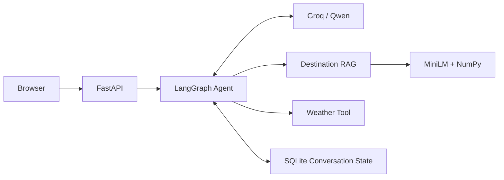

# TripMate

TripMate is an agentic AI travel assistant built with FastAPI, LangGraph,
Groq/Qwen, and local semantic retrieval. The agent decides whether each request
needs destination knowledge, weather information, both tools, or no tool.
Responses stream to a browser UI, and conversation threads retain context for
follow-up questions.

## What it does

### Destination Guide

TripMate performs semantic retrieval over the supplied guides for:

- Bangkok
- Barcelona
- Reykjavik
- Tokyo

The guides cover visa and entry information, best times to visit, local customs,
packing advice, and safety and health.

### Weather

TripMate provides deterministic monthly conditions for the same four
destinations.

> Weather data is mock monthly climatology for the assessment, not live weather.

Depending on the request, the model can use Destination Guide only, Weather
only, both tools sequentially, or no tool.

## Architecture



The browser sends a message to FastAPI. Qwen selects a tool through function
calling when external context is needed, and LangGraph executes that tool before
returning its result to the model. The model can then select another tool or
produce the final response, which streams to the browser.

Tool selection is controlled by the LLM using the supplied tool schemas. There
is no hardcoded keyword router.

The HTTP surface includes:

- `GET /api/health`
- `POST /api/chat`
- `POST /api/chat/stream`
- `GET /` for the browser UI

## Why this design

### LangGraph

LangGraph makes the agent loop explicit and supports sequential tool execution,
state checkpoints, and a bounded tool-call budget.

### Local RAG

The supplied corpus contains four destinations and 20 semantic sections.
MiniLM embeddings with NumPy cosine similarity are sufficient at this scale;
a vector database would add unnecessary operational complexity.

### Mock weather

Deterministic monthly weather keeps the demonstration reproducible and focuses
the implementation on tool selection and multi-tool synthesis.

### SQLite conversation state

SQLite provides simple persistent, thread-scoped state suitable for a local,
single-instance take-home application.

## How it works

| Tool | Purpose |
| --- | --- |
| `search_destination_guide(query)` | Semantic search over supplied destination guides |
| `get_weather_forecast(city, date_or_month)` | Monthly mock weather for supported destinations |

For example:

```text
I'm visiting Reykjavik in December. What should I pack?
```

The observed tool flow is:

```text
Destination Guide
        ↓
Weather
        ↓
Final synthesized answer
```

The model receives each tool result before deciding whether another tool is
needed. The application exposes tool activity, not private chain-of-thought.

## Run locally

Prerequisites:

- Python 3.11+
- A Groq API key

From PowerShell:

```powershell
python -m venv .venv
.\.venv\Scripts\python.exe -m pip install -e .
Copy-Item .env.example .env
```

Add your key to `.env`:

```env
GROQ_API_KEY=your_key_here
```

Start the application:

```powershell
.\.venv\Scripts\python.exe -m uvicorn tripmate.main:create_app --factory --host 127.0.0.1 --port 8000
```

Open http://localhost:8000.

On Linux or macOS, use `python3 -m venv .venv`, `.venv/bin/python` in place of
the Windows Python path, and `cp .env.example .env`.

## Configuration

The defaults required for the application are provided in `.env.example`.
For a normal evaluator run, only these values are relevant:

```env
GROQ_API_KEY=
GROQ_MODEL=qwen/qwen3.8-27b
```

Copy `.env.example` to `.env` and add your Groq API key. `.env` is excluded from
Git.

## Example queries

| Behavior | Query | Expected tools |
| --- | --- | --- |
| Destination knowledge | `What local customs should I know before visiting Tokyo?` | Destination Guide |
| Weather | `What weather should I expect in Bangkok in July?` | Weather |
| Multi-tool | `I'm visiting Reykjavik in December. What should I pack?` | Destination Guide, then Weather |
| Unsupported action | `Can you book me a flight to Barcelona?` | None; capability limitation |

## Conversational memory and streaming

Groq response tokens stream to the browser. Each conversation uses a UUID thread
ID, and LangGraph checkpoints its state in SQLite so follow-up questions can
reuse earlier context. **New Chat** creates a separate thread.

## Execution trace

The UI provides a collapsible trace showing selected tools, validated arguments,
tool completion, and final execution status. It does not expose private model
reasoning or raw provider responses.

## Project structure

```text
src/tripmate/
├── agent/          # LangGraph orchestration and Groq integration
├── api/            # FastAPI routes and schemas
├── rag/            # Destination loading, embeddings, and retrieval
├── tools/          # Deterministic monthly weather tool
├── static/         # Browser UI
├── config.py       # Environment-backed settings
├── observability.py
└── main.py         # Application factory

data/destinations/  # Supplied destination guides
```

## Limitations

- Destination knowledge is limited to Bangkok, Barcelona, Reykjavik, and Tokyo.
- Weather is deterministic monthly mock data, not live weather.
- SQLite and UUID thread IDs suit a local demo; they are not production
  authentication or distributed persistence.
- Long conversations are not summarized or compacted.
- Groq availability and quotas affect inference.
- For a larger corpus, the retrieval interface could be backed by pgvector,
  Qdrant, or another vector database.
